## About

I build desktop apps, Android libraries and web tools, mostly with Kotlin, Compose.

## Projects

### Libraries

**[Deskit](https://github.com/zahid4kh/deskit)**: Reusable components for Compose for Desktop, such as file and folder choosers and info and confirmation dialogs. Published on JitPack.

  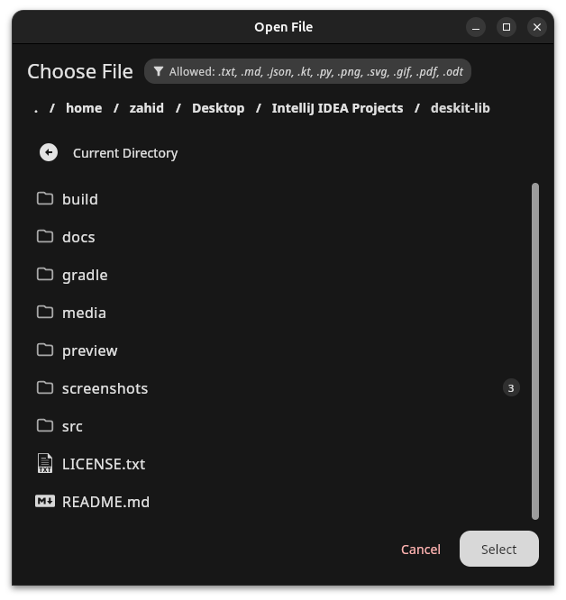
  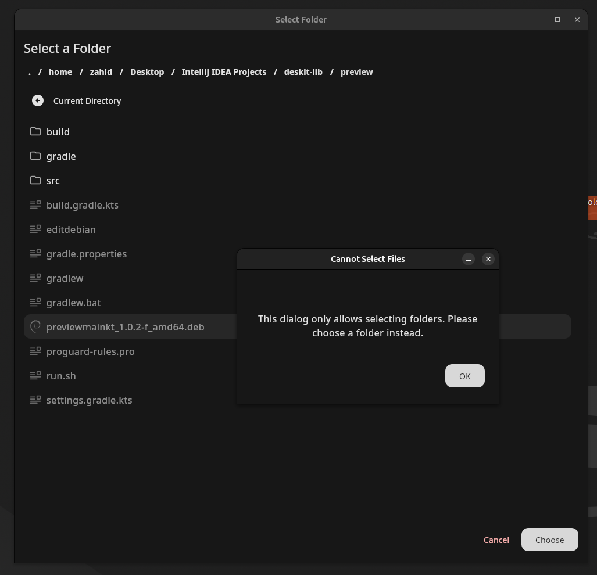
  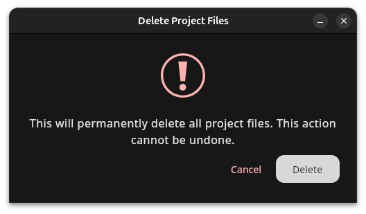

**[Compose Alert Kit](https://github.com/zahid4kh/compose-alert-kit)**: State-driven toasts, snackbars and dialogs for Jetpack Compose. Available on Maven Central and JitPack.

  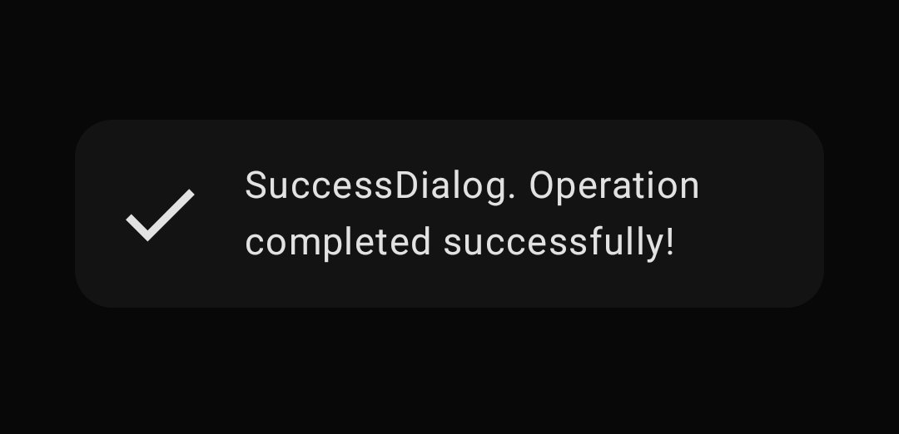
  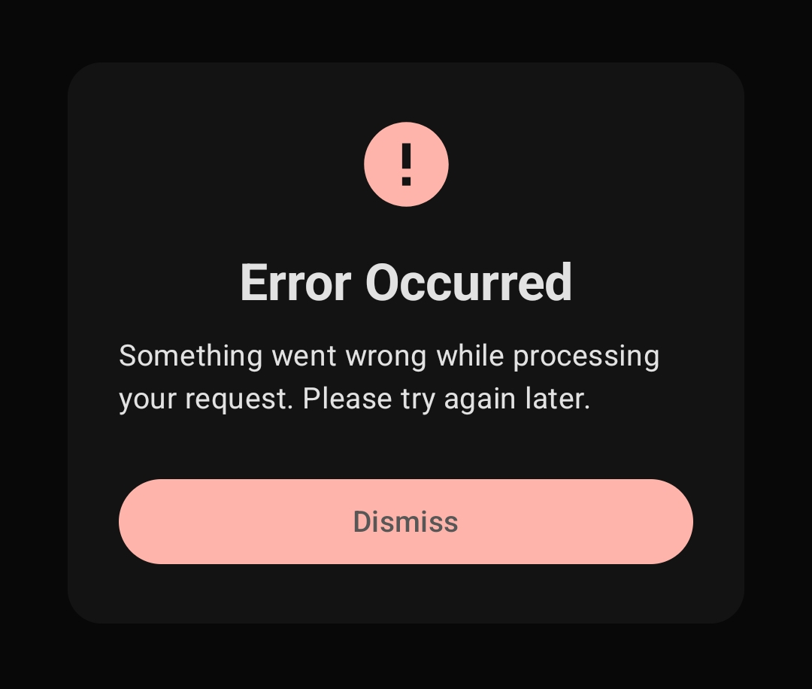
  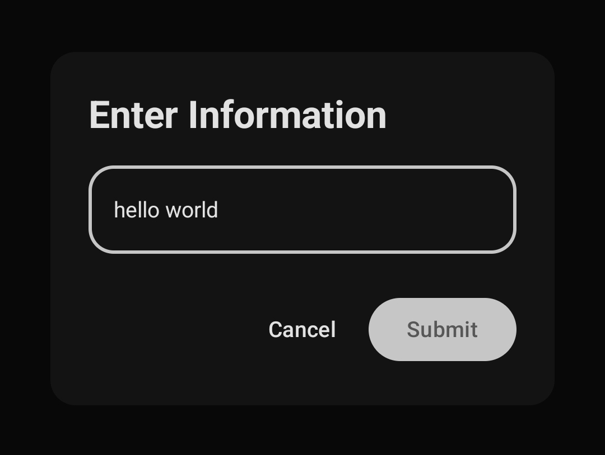

**[NeoBrutal UI(not updating)](https://github.com/zahid4kh/neobrutal-lib)**: Neo-brutalist UI components for Jetpack Compose: thick borders, hard shadows and high contrast. Published on JitPack.

  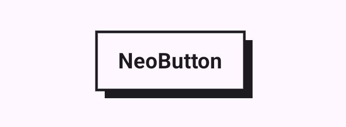
  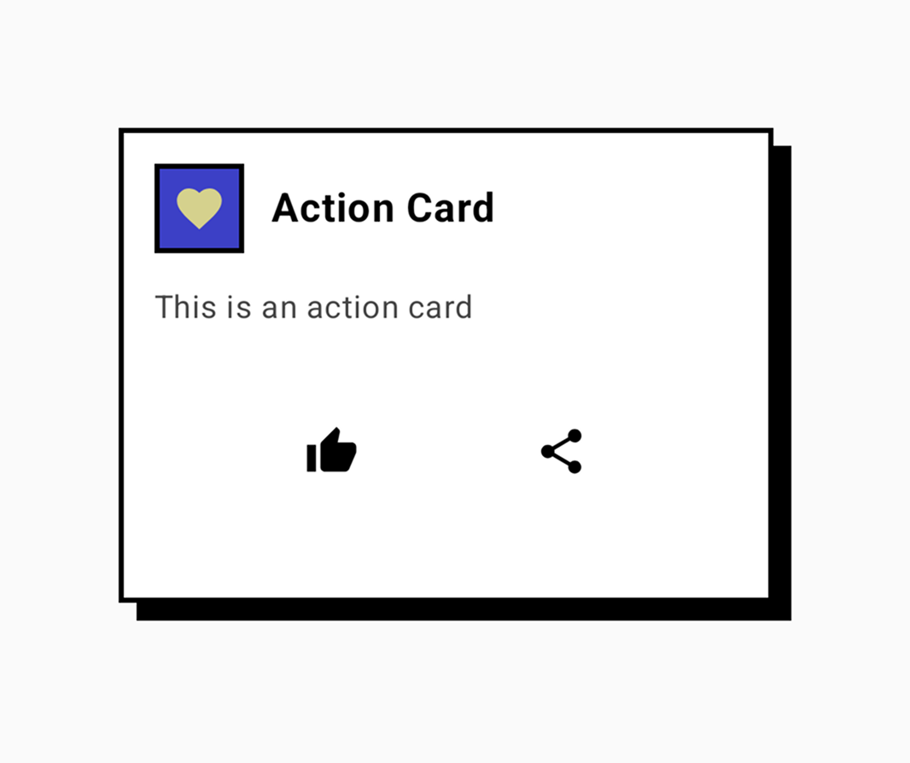
  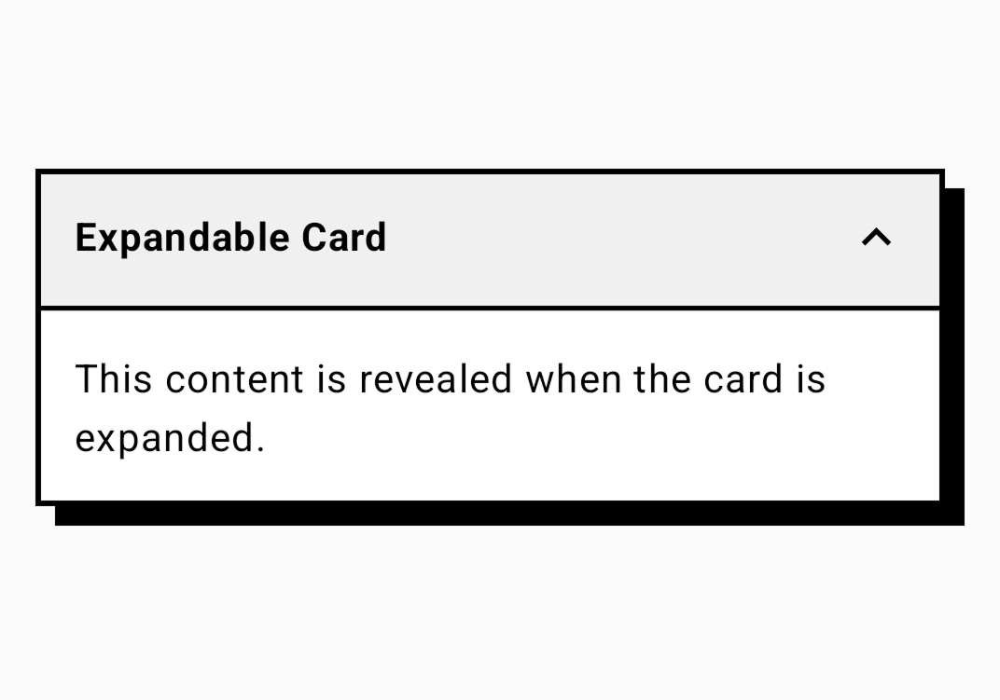

### Desktop apps

**[QODE](https://github.com/zahid4kh/QODE)**: Native code editor for Linux written in C++ and Qt 6. Has a project explorer, tabbed syntax-highlighted editor, integrated terminal and LSP support.

**[SumPDF](https://github.com/zahid4kh/sumpdf)**: Merge, split, reorder and extract PDF pages, and convert images and documents to PDF. Built with Compose for Desktop.

  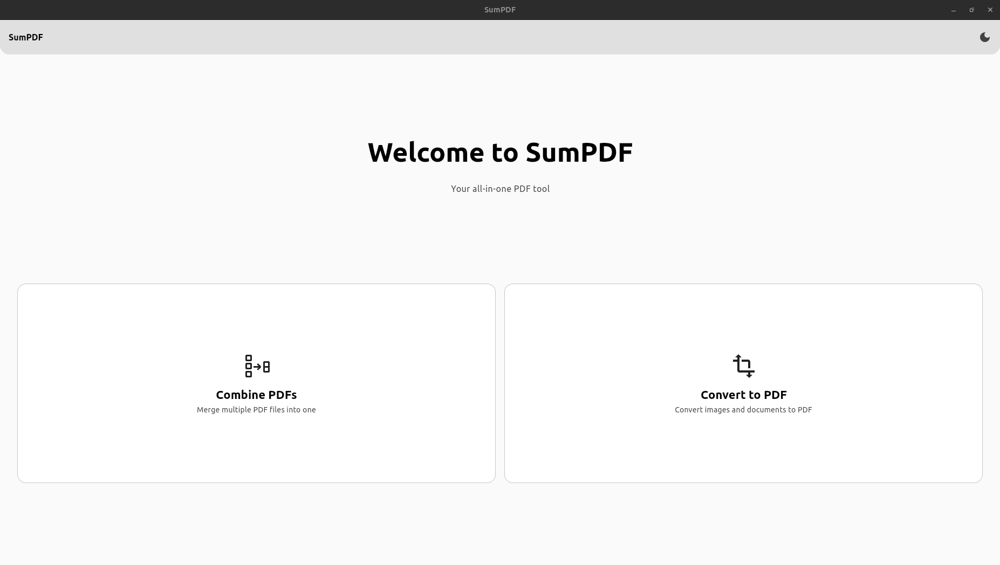
  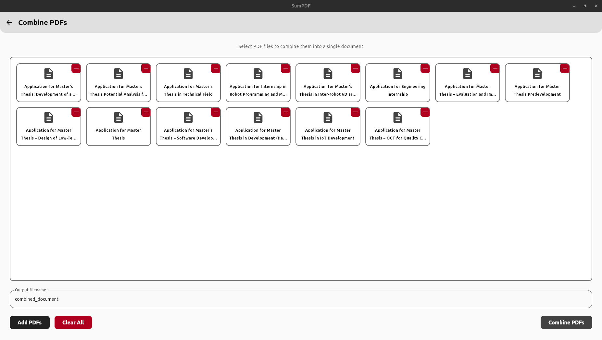
  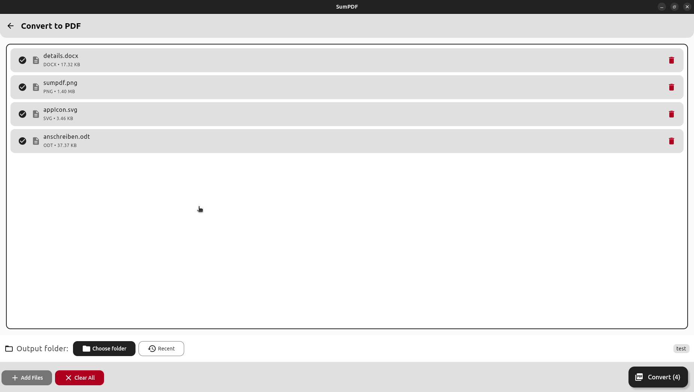

**[SimpleVideoEditor](https://github.com/zahid4kh/simplevideoeditor)**: Video editor for trimming, changing FPS and adding image and text overlays. Built with Compose Multiplatform and FFmpeg.

  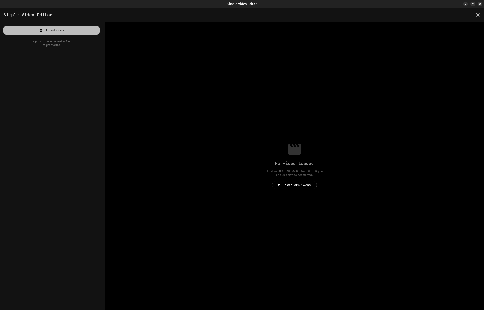
  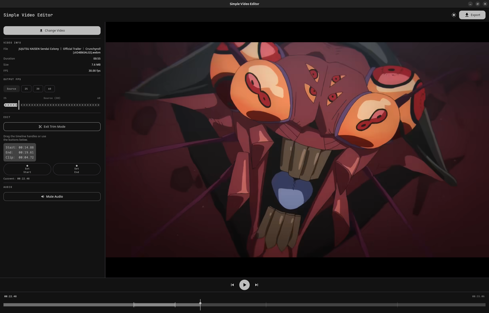

**[Compose for Desktop Wizard](https://github.com/zahid4kh/compose-for-desktop)**: Project generator for Compose for Desktop apps. Available as a [web app](https://composefordesktop.vercel.app/) and a native desktop client.

  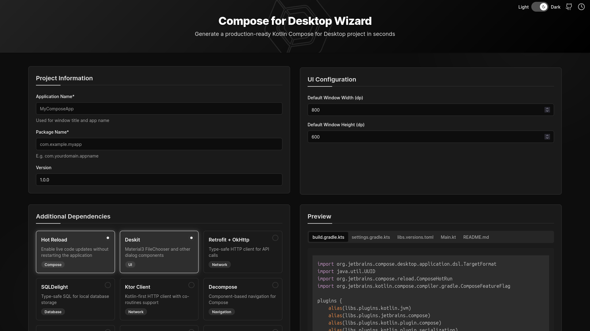
  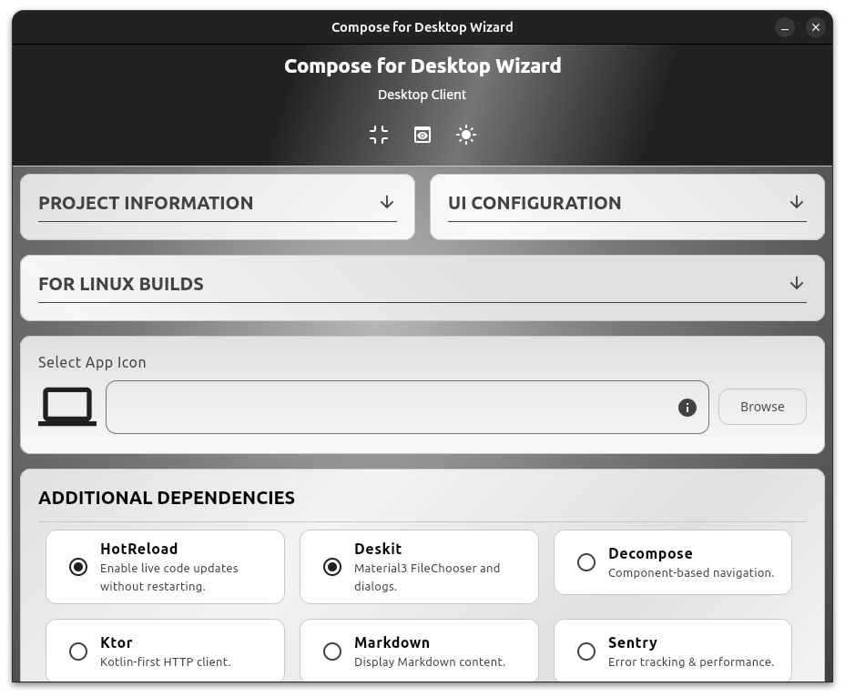

### Web apps

**[GRVector](https://grvector.vercel.app)**: Vector graphics editor in the browser. Pen, pencil and shape tools, Bézier node editing, layers, and export to SVG, PNG and JPG. Also has a frame-by-frame animator that exports MP4. Runs fully client-side. Source is private.

**[ScreenDeck](https://screendeck.vercel.app)**: Editor for making App Store and Google Play screenshots, with device frames and bulk PNG export.

## Tech

Kotlin, Compose (Android, Desktop, Multiplatform), C++, Qt 6, TypeScript, React, Next.js
